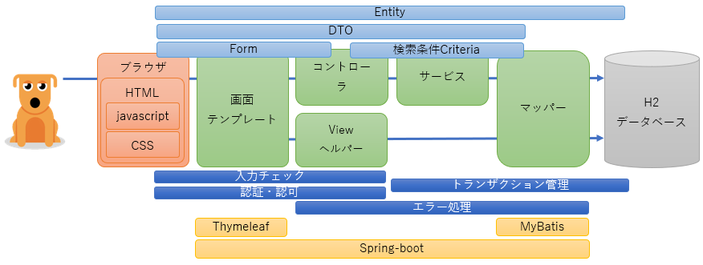
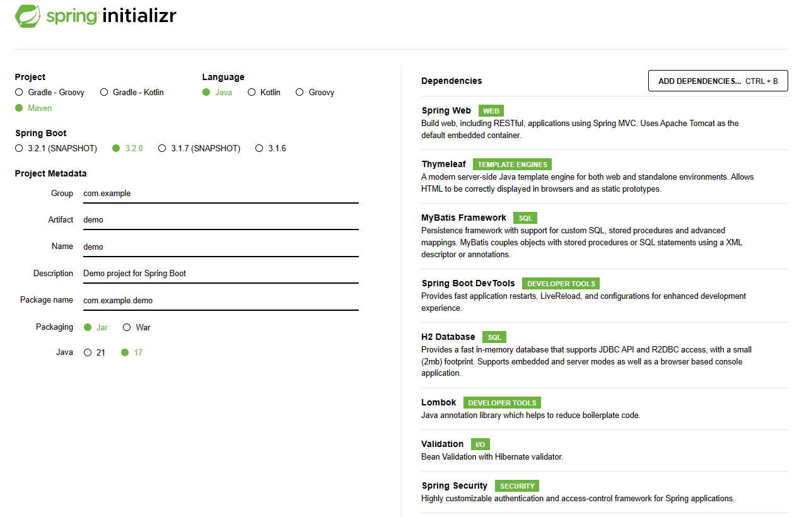

# spring-boot3-train

Spring-Bootで、がっちり業務アプリケーション開発

## やりたいこと

* マスタ管理を行うWEBの業務アプリケーションをがっちりと作る
* クラスやパッケージ等の命名はIDを使用する。`大規模案件ではID管理が必須`
* アプリケーション共通機能（認証、認可、エラー処理、コード管理）を作る。`業務アプリケーションには必須`
* 画面はThymeleafのHTMLテンプレートを使用することで、Tomcat起動を行わなくても、直接HTMLファイルを開けば画面モックとしてレイアウト確認ができる。`JSPよりもThymeleaf`
* テーブルは1テーブル
* CRUD機能（CREATE：登録機能、READ：照会機能、UPDATE：更新機能、DELETE：削除機能）を実装する
* 残っている`未実装`にチャレンジするべし
* javascriptとCSSは`未実装`のため、チャレンジするべし

## 前提

できれば、以下の初級編を先に動かしていること
https://github.com/namickey/spring-boot3-try

### 登録機能について
以下の機能を実装する
* 画面遷移
  - 登録画面⇒登録ボタン⇒確認画面⇒確認ボタン⇒HTTPリダイレクト⇒完了画面
  - 登録画面⇒登録ボタン⇒確認画面⇒戻るボタン⇒登録画面
* 入力チェック
  - 単項目チェック
  - 相関項目チェック
  - 業務チェック（DBとのチェックなど）
* 型変換、フォーマット変換
* テーブルに1件インサート処理
* プライマリーキーのシーケンス採番 `未実装`
* 登録サービスクラスに対する単体テスト

### 照会機能について
以下の機能を実装する
* 画面遷移
  - 照会画面⇒検索ボタン⇒照会画面⇒IDリンク⇒詳細画面⇒戻る
  - 照会画面⇒ページリンク⇒照会画面⇒IDリンク⇒詳細画面⇒戻る
* 初期表示時の検索結果表示
* 1ページ5件でのページング（オフセット、リミットによるページ制御）
* 最初ページ、途中ページ、最後のページへのリンク表示
* 最大ヒット総件数1000件未満のチェック
* 0件ヒット時のエラーメッセージ表示
* 複数テーブルからのSELECT処理 `未実装`
* 検索結果の各IDリンクから詳細画面へ遷移する
* 詳細画面ではテーブル項目を表示する
* 検索サービスクラスに対する単体テスト
* 詳細サービスクラスに対する単体テスト `未実装`

### 削除機能について
以下の機能を実装する
* 画面遷移
  - 削除画面⇒検索ボタン⇒削除ボタン⇒削除画面
  - 削除画面⇒ページリンク⇒削除ボタン⇒削除画面
* 初期表示時の検索結果表示
* 1ページ5件でのページング（オフセット、リミットによるページ制御）
* 最初ページ、途中ページ、最後のページへのリンク表示
* 最大ヒット総件数1000件未満のチェック
* 0件ヒット時のエラーメッセージ表示
* バージョン番号を使った、楽観ロック（楽観的排他制御）
  - テーブルカラムにバージョン番号列を持たせる
  - 更新機能によるデータ更新時にバージョン番号のカウントアップを行う
  - 削除や更新を行う場合に、直前にカウントアップしていた場合（誰か別の人が更新した）には、警告メッセージを表示する。
    - 警告メッセージの内容：`画面表示後に対象データが更新又は削除されました。再度、検索からやり直してください。`
  - 楽観ロックを用いない場合には、更新の処理結果が「後勝ち」となってしまい、削除では更新内容に気が付かないまま削除してしまうこととなる。
* 管理者(rootユーザでシステムロール保持)しか削除機能と更新機能を使用することができないように認可を設定
  - `WebSecurityConfig`クラスの`.requestMatchers("/WBA0401/**", "/WBA0501/**").hasRole("DATA_MANAGER")`で実現している
  - `AA0101/index.html`メニュー画面の`<th:block sec:authorize="hasRole('DATA_MANAGER')">`で削除画面へのリンクの制御（表示/非表示）をしている
* 削除サービスクラスに対する単体テスト `未実装`

### 更新機能
以下の機能を実装する
* 画面遷移
  - 照会画面⇒更新画面⇒更新ボタン⇒確認画面⇒確認ボタン⇒HTTPリダイレクト⇒完了画面
* 入力チェック
  - 単項目チェック
  - 相関項目チェック
* 型変換、フォーマット変換
* 1件更新
* バージョン番号を使った、楽観ロック（楽観的排他制御）
  - テーブルカラムにバージョン番号列を持たせる
  - 更新機能によるデータ更新時にバージョン番号のカウントアップを行う
  - 削除や更新を行う場合に、直前にカウントアップしていた場合（誰か別の人が更新した）には、警告メッセージを表示する。
    - 警告メッセージの内容：`画面表示後に対象データが更新又は削除されました。再度、検索からやり直してください。`
  - 楽観ロックを用いない場合には、更新の処理結果が「後勝ち」となってしまい、削除では更新内容に気が付かないまま削除してしまうこととなる。
* 管理者(rootユーザでシステムロール保持)しか削除機能と更新機能を使用することができないように認可を設定
  - `WebSecurityConfig`クラスの`.requestMatchers("/WBA0401/**", "/WBA0501/**").hasRole("DATA_MANAGER")`で実現している
  - `BA0201/search.html`照会画面の`<th:block sec:authorize="hasRole('DATA_MANAGER')">`で更新画面へのリンクの制御（表示/非表示）をしている

> [!TIP]
> Spring Frameworkを利用する実プロジェクトで活用できる設計・開発標準  
> https://fintan.jp/page/5311/  
> https://github.com/Fintan-contents/spring-sample-project/tree/main/sourcecode/web  

## アプリケーション構成



* 画面層（画面テンプレート、HTML、javascript、CSS）
  - ユーザインタフェース
  - ユーザ操作によりイベント発生
  - アプリケーションからの結果返却、メッセージ通知
  - javascript `#未実装`
  - CSS `#未実装`
* コントローラ層（コントローラクラス、フォームクラス、ヘルパークラス）
  - 画面遷移
  - 入力チェック
  - メッセージ出力
  - フォームクラスから、登録用エンティティオブジェクト生成
  - フォームクラスから、検索条件オブジェクト生成
* サービス層（サービスクラス、DTO）
  - 業務処理
  - 業務例外
  - トランザクション管理
  - DTO `#未実装`
* データ層（ORマッパー、XMLファイル）
  - SQL発行
  - JAVAオブジェクトとデータのマッピング、型変換、フォーマット変換
  - 登録者、登録日時、更新者、更新日時の自動付与 `#未実装`

## 前提環境

以下がインストール済みであること
* JDK 17
* gitbash
* 統合開発環境（vscode or eclipse）

## 使用するフレームワーク

* spring-boot3.2
* spring-boot-starter-web
* spring-boot-devtools
* spring-boot-starter-security
* spring-boot-starter-validation
* thymeleaf
* mybatis
* spring-data-commons
* lombok
* 組み込みH2データベース
* 組み込みTomcat 10
* 組み込みMaven 3

## ディレクトリ階層
```
C:.
│  .gitignore
│  mvnw
│  mvnw.cmd
│  pom.xml
│  README.md
├─.mvn
│  └─wrapper
│          maven-wrapper.jar
│          maven-wrapper.properties
├─src
│  ├─main
│  │  ├─java
│  │  │  └─com
│  │  │      └─example
│  │  │          └─demo
│  │  │              │  DemoApplication.java
│  │  │              ├─common
│  │  │              │  └─code  コード管理
│  │  │              │          ItemGroup.java
│  │  │              ├─core
│  │  │              │  ├─exception
│  │  │              │  │      AppException.java
│  │  │              │  │      SystemException.java
│  │  │              │  ├─handler  例外ハンドラー
│  │  │              │  │      WebExceptionHandler.java
│  │  │              │  └─security  認証、認可
│  │  │              │          DbUserDetailsService.java　　ログイン機能DB `未実装`
│  │  │              │          MockUserDetailsService.java　ログイン機能モック
│  │  │              │          WebSecurityConfig.java       認証、認可設定
│  │  │              ├─entity
│  │  │              │      Item.java
│  │  │              └─web
│  │  │                  ├─aa01    TOP画面
│  │  │                  │      AA0101Controller.java
│  │  │                  ├─ba01    登録機能
│  │  │                  │      BA0101Controller.java
│  │  │                  │      ItemForm.java
│  │  │                  │      ItemRegistService.java
│  │  │                  │      ItemRegistViewHelper.java
│  │  │                  ├─ba02    照会機能（検索画面）
│  │  │                  │      BA0201Controller.java
│  │  │                  │      ItemSearchCriteria.java
│  │  │                  │      ItemSearchForm.java
│  │  │                  │      ItemSearchService.java
│  │  │                  ├─ba03    照会機能（詳細画面）
│  │  │                  │      BA0301Controller.java
│  │  │                  │      ItemDetailForm.java
│  │  │                  │      ItemDetailService.java
│  │  │                  ├─ba04    削除機能
│  │  │                  │      BA0401Controller.java
│  │  │                  │      ItemDeleteForm.java
│  │  │                  │      ItemDeleteService.java
│  │  │                  ├─ba05    更新機能
│  │  │                  │      BA0501Controller.java
│  │  │                  │      ItemUpdateForm.java
│  │  │                  │      ItemUpdateKeyForm.java
│  │  │                  │      ItemUpdateService.java
│  │  │                  └─mapper
│  │  │                          ItemMapper.java
│  │  └─resources
│  │      │  application.properties
│  │      │  data-all.sql           SQL（データinsert文）
│  │      │  messages.properties    メッセージ管理
│  │      │  schema-all.sql         DDL（テーブルCreate文）
│  │      ├─com
│  │      │  └─example
│  │      │      └─demo
│  │      │          └─web
│  │      │              └─mapper
│  │      │                      ItemMapper.xml    MyBatisのマッパーXML
│  │      └─templates
│  │          │  error.html         システムエラー画面
│  │          ├─AA0101
│  │          │      index.html     メニュー画面
│  │          ├─BA0101
│  │          │      complete.html  完了画面
│  │          │      confirm.html   確認画面 
│  │          │      regist.html    登録画面
│  │          ├─BA0201
│  │          │      search.html    検索画面
│  │          ├─BA0301
│  │          │      index.html     照会画面
│  │          ├─BA0401
│  │          │      delete.html    削除画面
│  │          ├─BA0501
│  │          │      complete.html  完了画面
│  │          │      confirm.html   確認画面 
│  │          │      update.html    更新画面
│  │          └─error
│  │                  403.html      認証認可エラー画面
│  │                  404.html      Not Foundエラー画面
│  └─test
│      └─java
│          └─com
│              └─example
│                  └─demo
│                      └─web
│                          ├─ba01
│                          │      ItemRegistServiceTest.java
│                          │      ItemRegistViewHelperTest.java
│                          │
│                          └─ba02
│                                  ItemSearchServiceTest.java
```

## 準備 githubからソースコードを取得

gitを使ってソースコードをダウンロードする
```
コマンドプロンプトで実行
git clone https://github.com/namickey/spring-boot3-train.git
cd spring-boot3-train
```

## 実行 spring-boot:run

起動する
```
コマンドプロンプトで実行
mvnw.cmd spring-boot:run
```

## ログインユーザと認可権限について

開発向けのログイン機能のモック実装(`MockUserDetailsService`)として、ユーザIDと同じパスワードを入力することで、ログインできるようにしている。  
例（ユーザID/パスワード）：hoge/hoge、foo/foo、etc/etc  

また削除画面と更新画面については、`root/root`等でログインすることで、データ管理者権限ロールが付与されて削除画面と更新画面が表示されるように認可機能によるアクセス制限を行っている。  

| 画面 | ロール |
----|----
| 登録画面 | 一般（user）の利用可 |
| 照会画面 | 一般（user）の利用可 |
| 詳細画面 | 一般（user）の利用可 |
| 削除画面 | データ管理者権限（DATA_MANAGER）のみ利用可 ※`root/root`,`data/data`,`manager/manager`でログイン |
| 更新画面 | データ管理者権限（DATA_MANAGER）のみ利用可 ※`root/root`,`data/data`,`manager/manager`でログイン |

## ブラウザアクセス
http://localhost:8080/

機能一覧
* ログイン画面からログインする
* 登録画面でitemを登録する
* 照会画面でitemを検索し、詳細画面を閲覧する
* 削除画面でitemを削除する(※`root/root`,`data/data`,`manager/manager`でログイン)
* 更新画面でitemを更新する(※`root/root`,`data/data`,`manager/manager`でログイン)

## H2データベースのコンソール

以下のURLにブラウザからアクセスし、データベースのテーブルを確認する  
http://localhost:8080/h2-console  
```
表示されたH2データベースの接続画面にて、以下の情報を記載して接続する
JDBC URL=jdbc:h2:mem:testdb
User Name=sa
Password=
```

## 停止
```
コマンドプロンプトで実行
Ctrl + C
```

## やってみよう 

1. `Spring Initializr`から初期構成のアプリケーションをダウンロードする  
https://start.spring.io/

2. 統合開発環境を使って、今動かしたソースコードと同じものを実装し、動作確認する
3. 自分のgithubアカウントを作って、作ったソースを公開しよう
4. githubでgitフローを使って開発しよう
5. 未実装機能の実装にチャレンジしよう
6. 分からないことはGitHub Copilotに書いてもらおう。AI補助を体験しよう

## アプリケーション共通機能について

今回のアプリケーションが備える共通機能（認証認可、エラー処理、コード管理）について概要を示す  
未実装の機能については、`#未実装`と記載

### 認証・認可機能

* 認証機能
  - Spring-Securtyを使って実現する
  - IDとパスワードを用いた認証を行う
  - 認証済みアクセス以外は、認証エラー画面を表示する
    以下、未実装
  - 初回ログイン時のパスワード変更 `#未実装`
  - 三か月毎のパスワード変更 `#未実装`
  - 過去に使用したパスワード使用不可 `#未実装`
  - パスワードに使用するべき文字種類の必須指定 `#未実装`
  - システム管理者によるパスワードリセット `#未実装`
  - 本人宛メールによるパスワードリセット `#未実装`
  - 指定回数のパスワード誤りによる指定時間のロック `#未実装`
  - 指定時間経過後、またはシステム管理者によるロック解除 `#未実装`
* 環境毎での認証コンポーネント切り替える
  - アプリケーションプロパティファイルを使い切り替えを行う
  - 本番環境用の認証コンポーネントではデータベースでのユーザIDとパスワードを管理する `#未実装`  
    パスワードはハッシュ化してデータベースに保管する  
    パスワードのハッシュ化には`PBKDF2`という強度が高いハッシュ化モジュールを使用する
  - 開発環境用のログイン機能のモック実装(`MockUserDetailsService`)では、特にユーザ管理は行わず、ユーザIDと同じパスワードで認証を行う
* 認可機能
  - Spring-Securtyを使って実現する
  - ユーザ毎に強い権限、弱い権限を持たせ、それらをロールとして定義し、ユーザ毎に管理を行う
  - ロール毎にアクセス可能な画面URLを定義を行い、強い権限を持つシステム管理者ロールを持つユーザだけがアクセスできるシステム管理画面を作成するなどの認可の画面制御を行う
  - 弱い権限しか持たない一般ロールを持つユーザには、システム管理画面への画面リンクを表示しない制御を行う
  - 認可されていないユーザが直接URLを開くなど、不正にアクセスした場合には、認可エラー画面を表示する
  - ユーザとロールの紐づけをデータベースで管理 `#未実装`
  - 組織単位、部署単位の認可制御 `#未実装`

### エラー処理

* エラー種類
  - 入力チェックエラー  
    ⇒ユーザに改善と再実行を促すメッセージを画面表示する
  - 業務エラー  
    ⇒ユーザに改善と再実行を促すメッセージを画面表示する  
    ⇒トランザクションはロールバックする
  - システムエラー  
    ⇒予期せぬエラーで業務処理の継続不可、システム管理者へ通知する  
    ⇒システムエラー画面に遷移する  
    ⇒トランザクションはロールバックする
  - 認証・認可エラー  
    ⇒不正アクセス防止のため、処理の継続不可  
    ⇒認証・認可エラー画面に遷移する
* 例外クラス、例外ハンドラー
  - 業務アプリケーション例外クラス  
    ⇒業務機能ごとのサービスクラスやコントローラクラスで例外スローや例外ハンドリングを行う
    ⇒ハンドリング内容としては、前の画面への遷移や、画面へのメッセージ表示を行う
  - システム例外クラス  
    ⇒システムで共通した例外ハンドラーを作成し、例外ハンドリングを行う  
    ⇒ハンドリング内容としては、システムエラー画面への遷移や、システム管理者への通知、スタックトレースのログ出力
* メッセージ管理
  - メッセージプロパティファイルにて、メッセージIDとメッセージ内容の管理を行う

### コード管理
* 例：結果コード（0=正常、1=異常）  
  例：ステータスコード（0=未処理、1=処理中、2=正常終了、3=異常終了）  
  例：拠点コード（01=東京、02=大阪）
* enumを使ったコード管理  
* 定数クラスを使ったコード管理 `#enum以外の実現方法`
* データベースを使ったコード管理 `#enum以外の実現方法`

> [!NOTE]
> ## NEXT クラウドへ挑戦してみよう
> 
> * AWSへデプロイ
> * Dockerコンテナイメージとしてビルドして、コンテナ起動
> * Terraformを使って、クラウド環境の自動構築及びデプロイ自動化
> 
> 次にAWSへのデプロイを学ぼう
> https://github.com/namickey/vpc-ec2-try
> 
> 次にGitHubからAWSへの自動デプロイを学ぼう
> https://github.com/namickey/spring-boot2-aws-terraform

> [!NOTE]
> ## システム構成及びアプリケーション構成について学ぼう
> https://github.com/namickey/spring-boot2-system  

> [!NOTE]
> ## 参考
> 
> Spring Security 5.4〜6.0でセキュリティ設定の書き方が大幅に変わる件  
> https://qiita.com/suke_masa/items/908805dd45df08ba28d8  
> 
> 【Spring Security】認証・認可の基礎  
> https://b1san-blog.com/post/spring/spring-sec-auth/  
> 
> Spring Bootにおけるページング  
> https://qiita.com/takaakitanaka_cre-co/items/1571bcd870bd64d83d15  
> 
> JUnit5を使おう  
> https://www.m3tech.blog/entry/2018/12/20/junit5  
> 
> JUnit5におけるMockitoの利用方法  
> https://qiita.com/kirin1218/items/37ed388759a4c7d94b75  
> 
> 【11万文字越え】プログラミング初心者に贈る即戦力ガイド  
> https://qiita.com/nuco_bk/items/27f5ad03d0c4b41241fc  
